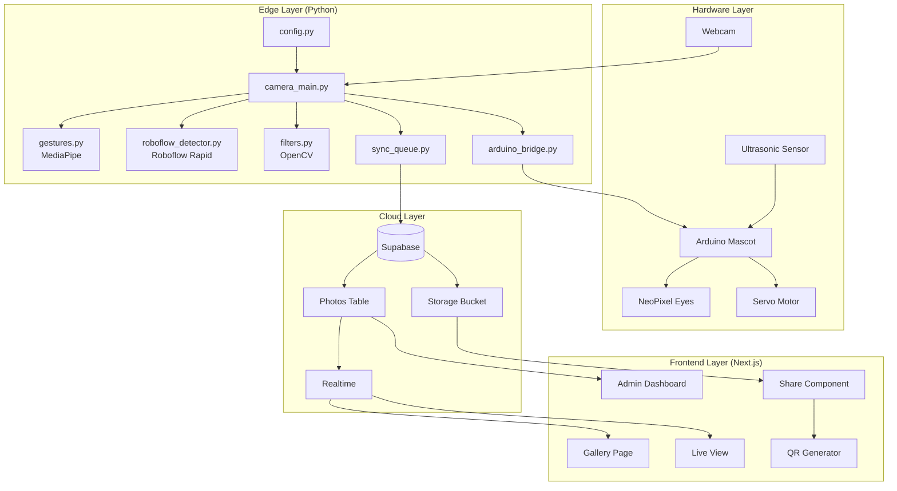

# Design Document: Mascot Photo Booth V2

## Overview

Mascot Photo Booth V2 is an enhanced IoT photo booth system that combines gesture-based photo capture with AI-powered object detection, social sharing, and an improved web gallery. The system architecture follows a layered approach with clear separation between hardware control, edge processing, cloud storage, and frontend presentation.

The key enhancements over V1 include:
- Optional Roboflow Rapid integration for custom object detection
- Social sharing with QR codes and direct links
- Multiple capture modes (single, burst, GIF)
- Admin dashboard with analytics
- Cloud-only storage mode (no offline queue)
- Enhanced mascot animations based on AI detections
- Excel Techfest 2025 themed UI with polaroid-style photo cards

**V2.1 Updates**:
- Excel Techfest design theme with polaroid cards and timeline layout
- Filter selection visual feedback (no reset button)
- Camera window controls (close, minimize, ESC/Q keys)
- Burst mode: 4-second countdown, 4 photos, preview on camera, single collage output
- Thumbs-up only triggers photo capture

## Architecture



## Components and Interfaces

### 1. Gesture Detection Module (`gestures.py`)

Handles hand gesture recognition using MediaPipe.

```python
class GestureRecognizer:
    def __init__(self, min_confidence: float = 0.7)
    def process_frame(self, rgb_frame: np.ndarray) -> Tuple[Results, Optional[str]]
    def get_confidence(self) -> float
```

**Gestures Supported:**
- `THUMBS_UP` → Trigger photo capture
- `PEACE` / `LOVE` → Trigger love animation
- `POINTING` / `SUS` → Trigger suspicious animation
- `OPEN_HAND` → Trigger rainbow animation

### 2. Roboflow Detector Module (`roboflow_detector.py`)

Optional AI-powered object detection using Roboflow Rapid API.

```python
@dataclass
class Detection:
    class_name: str
    confidence: float
    bbox: Tuple[int, int, int, int]  # x, y, width, height

class RoboflowDetector:
    def __init__(self, api_key: str, model_id: str, confidence_threshold: float = 0.8)
    def detect(self, frame: np.ndarray) -> List[Detection]
    def draw_detections(self, frame: np.ndarray, detections: List[Detection]) -> np.ndarray
    def is_available(self) -> bool
```

### 3. Filter Module (`filters.py`)

Image processing filters using OpenCV.

```python
class FilterType(Enum):
    NONE = "none"
    GLITCH = "glitch"      # RGB channel shifting, scan lines
    NEON = "neon"          # High contrast, neon color enhancement (cyberpunk)
    DREAMY = "dreamy"      # Soft blur, pastel tones
    RETRO = "retro"        # Polaroid border with timestamp
    NOIR = "noir"          # High contrast black and white

def apply_filter(image: np.ndarray, filter_type: FilterType) -> np.ndarray
def apply_glitch(image: np.ndarray) -> np.ndarray
def apply_neon(image: np.ndarray) -> np.ndarray
def apply_dreamy(image: np.ndarray) -> np.ndarray
def apply_retro(image: np.ndarray, text: str = "EXCEL 2025") -> np.ndarray
def apply_noir(image: np.ndarray) -> np.ndarray
```

### 4. Capture Modes Module (`capture_modes.py`)

Different photo capture modes.

```python
class CaptureMode(Enum):
    SINGLE = "single"
    BURST = "burst"
    GIF = "gif"

@dataclass
class CaptureResult:
    mode: CaptureMode
    images: List[np.ndarray]
    timestamps: List[float]
    collage_image: Optional[np.ndarray]  # For burst mode
    gif_bytes: Optional[bytes]  # For GIF mode
    output_path: Optional[str]

class CaptureManager:
    def __init__(self, photo_dir: str)
    def capture_single(self, frame: np.ndarray, filter_type: FilterType, save_to_disk: bool = False) -> CaptureResult
    def capture_burst(self, cap: cv2.VideoCapture, filter_type: FilterType, count: int = 4, interval_ms: int = 500, save_to_disk: bool = False) -> CaptureResult
    def capture_gif(self, cap: cv2.VideoCapture, frames: int = 8, interval_ms: int = 200, filter_type: FilterType = None, save_to_disk: bool = False) -> CaptureResult
    def create_collage(self, images: List[np.ndarray]) -> np.ndarray
    def show_countdown(self, cap: cv2.VideoCapture, seconds: int = 4) -> None
    def show_preview(self, images: List[np.ndarray], duration_ms: int = 2000) -> None
```

**Burst Mode Flow:**
1. User triggers burst mode via thumbs-up gesture
2. System displays 4-second countdown on camera display
3. System captures 4 photos with 500ms intervals
4. System displays all 4 photos as preview on camera screen
5. System creates 2x2 collage from the 4 photos
6. System uploads only the collage image to Supabase

### 5. Sync Queue Module (`sync_queue.py`)

Handles offline storage and cloud synchronization.

```python
@dataclass
class QueuedPhoto:
    local_path: str
    timestamp: float
    filter_type: str
    retry_count: int = 0
    status: str = "pending"

class SyncQueue:
    def __init__(self, queue_file: str = "sync_queue.json")
    def add(self, photo: QueuedPhoto) -> None
    def process_queue(self) -> int  # Returns number of successfully synced
    def get_pending_count(self) -> int
    def get_queue_size_bytes(self) -> int
    def mark_failed(self, photo_id: str) -> None
```

### 6. Configuration Module (`config.py`)

Centralized configuration management.

```python
@dataclass
class Config:
    # Supabase
    supabase_url: str
    supabase_anon_key: str
    
    # Roboflow (optional)
    roboflow_api_key: Optional[str] = None
    roboflow_model_id: Optional[str] = None
    roboflow_confidence: float = 0.8
    
    # Arduino
    arduino_port: str = "COM3"
    arduino_baud_rate: int = 9600
    
    # Capture
    photo_dir: str = "photos"
    capture_cooldown: float = 3.0
    gesture_confidence: float = 0.7
    
    # Sync
    max_local_storage_mb: int = 1024
    max_retry_attempts: int = 3

def load_config(config_path: str = "config.json") -> Config
def validate_config(config: Config) -> List[str]  # Returns list of errors
def config_to_json(config: Config) -> str
def config_from_json(json_str: str) -> Config
```

### 7. Arduino Bridge Module (`arduino_bridge.py`)

Serial communication with Arduino mascot.

```python
class AnimationType(Enum):
    NORMAL = "NORMAL"
    WINK = "WINK"
    FLASH = "FLASH"
    LOVE = "LOVE"
    SUS = "SUS"
    RAINBOW = "RAINBOW"
    WELCOME = "WELCOME"

class ArduinoBridge:
    def __init__(self, port: str, baud_rate: int = 9600)
    def send_command(self, animation: AnimationType) -> bool
    def is_connected(self) -> bool
    def close(self) -> None
```

### 8. Web Gallery Components

#### Gallery Page (`pages/index.js`)
- Excel Techfest 2025 themed design
- Polaroid-style photo cards with pin decorations
- Vertical timeline connector between photos
- Realtime photo grid with Supabase subscription
- Filter buttons with active state highlighting (no reset button)
- Capture mode buttons with active state

**Design Theme:**
- Dark background (#050505)
- Gold/orange accent colors (#FFD700, #FF8C00)
- Monospace fonts (Share Tech Mono, Orbitron)
- Polaroid cards with white border, shadow, and pin decoration
- Timeline layout with golden vertical connector

#### Polaroid Card Component
```typescript
interface PolaroidCardProps {
    photo: Photo;
    index: number;
}
// Displays:
// - Pin decoration at top
// - Photo image
// - REC_DATE: timestamp
// - LOC: "College Ground" or location
// - [EXCELETED] badge
```

#### Filter Controls
```typescript
interface FilterControlsProps {
    activeFilter: string | null;
    onFilterChange: (filter: string | null) => void;
}
// Filters: GLITCH, NEON, DREAMY, RETRO, NOIR
// Click active filter to deselect (no reset button)
```

#### Share Component (`components/ShareButtons.js`)
```typescript
interface ShareButtonsProps {
    photoUrl: string;
    photoId: string;
    caption?: string;
}
```

#### QR Code Component (`components/QRCode.js`)
```typescript
interface QRCodeProps {
    url: string;
    size?: number;
}
```

#### Admin Dashboard (`pages/admin.js`)
- Photo management (delete, hide, approve)
- Analytics charts (photos/day, filter usage, gesture counts)
- CSV export functionality
- Moderation queue

### 9. Camera Window Controls

The camera window will include custom controls for better UX:

```python
class CameraWindow:
    def __init__(self, window_name: str = "Mascot View")
    def create_window(self, fullscreen: bool = True) -> None
    def add_controls_overlay(self, frame: np.ndarray) -> np.ndarray
    def handle_key_events(self, key: int) -> str  # Returns action: "close", "minimize", "toggle_fullscreen", "none"
```

**Key Bindings:**
- `Q` or `q`: Close application
- `ESC`: Exit fullscreen / toggle windowed mode
- `M` or `m`: Minimize window

**Overlay Controls:**
- Close button (X) in top-right corner
- Minimize button (-) next to close
- Current filter name display
- Current mode display

## Data Models

### Photo Record (Supabase)

```sql
CREATE TABLE photos (
    id UUID PRIMARY KEY DEFAULT gen_random_uuid(),
    image_url TEXT NOT NULL,
    thumbnail_url TEXT,
    filter_type TEXT DEFAULT 'none',
    capture_mode TEXT DEFAULT 'single',
    gesture_trigger TEXT,
    roboflow_detections JSONB,
    is_visible BOOLEAN DEFAULT true,
    is_approved BOOLEAN DEFAULT true,
    created_at TIMESTAMPTZ DEFAULT NOW(),
    local_timestamp TIMESTAMPTZ,
    metadata JSONB
);
```

### Analytics Record (Supabase)

```sql
CREATE TABLE analytics (
    id UUID PRIMARY KEY DEFAULT gen_random_uuid(),
    event_type TEXT NOT NULL,
    event_data JSONB,
    created_at TIMESTAMPTZ DEFAULT NOW()
);
```

### Sync Queue (Local JSON)

```json
{
    "queue": [
        {
            "id": "uuid",
            "local_path": "photos/photo_123.jpg",
            "timestamp": 1702000000.0,
            "filter_type": "polaroid",
            "retry_count": 0,
            "status": "pending"
        }
    ],
    "last_sync": 1702000000.0
}
```

### Configuration (JSON)

```json
{
    "supabase_url": "https://xxx.supabase.co",
    "supabase_anon_key": "eyJ...",
    "roboflow_api_key": "rf_xxx",
    "roboflow_model_id": "mascot-props/1",
    "roboflow_confidence": 0.8,
    "arduino_port": "COM3",
    "arduino_baud_rate": 9600,
    "photo_dir": "photos",
    "capture_cooldown": 3.0,
    "gesture_confidence": 0.7,
    "max_local_storage_mb": 1024,
    "max_retry_attempts": 3
}
```

## Correctness Properties

*A property is a characteristic or behavior that should hold true across all valid executions of a system-essentially, a formal statement about what the system should do. Properties serve as the bridge between human-readable specifications and machine-verifiable correctness guarantees.*

### Property 1: Gesture confidence threshold filtering
*For any* gesture detection result with confidence score below 0.7, the system should reject the gesture and return None.
**Validates: Requirements 1.4**

### Property 2: Gesture-to-animation mapping consistency
*For any* recognized gesture (THUMBS_UP, PEACE, POINTING), the system should always map to the same corresponding animation command.
**Validates: Requirements 1.2, 1.3**

### Property 3: Single hand processing
*For any* frame containing multiple detected hands, the system should process exactly one hand and ignore the rest.
**Validates: Requirements 1.5**

### Property 4: Roboflow detection overlay correctness
*For any* valid Detection_Result from Roboflow, the system should draw bounding boxes at the exact coordinates specified in the result.
**Validates: Requirements 2.2**

### Property 5: Detection confidence animation trigger
*For any* Roboflow detection with confidence above 0.8, the system should trigger the corresponding custom animation.
**Validates: Requirements 2.5**

### Property 6: Noir filter correctness
*For any* input image, applying the NOIR filter should result in an image where all pixels have equal R, G, and B values (grayscale).
**Validates: Requirements 3.5**

### Property 7: Retro filter dimension increase
*For any* input image with dimensions (H, W), applying the RETRO filter should result in an image with dimensions greater than (H, W) due to the added polaroid border.
**Validates: Requirements 3.4**

### Property 8: No-filter identity
*For any* input image, when no filter is selected, the output image should be byte-identical to the input.
**Validates: Requirements 3.5**

### Property 9: Unique shareable URL generation
*For any* set of captured photos, each generated shareable URL should be unique.
**Validates: Requirements 4.3**

### Property 10: QR code URL encoding correctness
*For any* photo URL, the generated QR code should decode back to the exact same URL.
**Validates: Requirements 4.4**

### Property 11: Burst mode photo count
*For any* burst mode capture, the system should capture exactly 4 photos and produce exactly 1 collage image.
**Validates: Requirements 5.2, 5.4, 5.5**

### Property 12: GIF frame count
*For any* GIF mode capture, the resulting GIF should contain exactly 8 frames.
**Validates: Requirements 5.6**

### Property 13: Collage composition
*For any* burst mode result, the collage image should have dimensions that accommodate all 4 source images in a 2x2 grid layout.
**Validates: Requirements 5.4**

### Property 14: Moderation mode visibility
*For any* photo uploaded while moderation mode is enabled, the photo should not be visible in the public gallery until approved.
**Validates: Requirements 6.3**

### Property 15: CSV export completeness
*For any* set of photos in the database, the exported CSV should contain one row per photo with all required metadata fields.
**Validates: Requirements 6.5**

### Property 16: Gallery chronological ordering
*For any* set of photos displayed in the gallery, they should be ordered by created_at timestamp in descending order.
**Validates: Requirements 7.2**

### Property 17: Live view shows latest
*For any* gallery state in live view mode, only the photo with the most recent timestamp should be displayed.
**Validates: Requirements 7.3**

### Property 18: Reconnection photo recovery
*For any* photos uploaded during a disconnection period, all photos should appear in the gallery after reconnection.
**Validates: Requirements 7.5**

### Property 19: Offline storage preservation
*For any* photo captured while offline, the photo should be saved to local storage with all metadata intact.
**Validates: Requirements 8.1**

### Property 20: Sync queue upload completeness
*For any* photos in the sync queue when connectivity is restored, all photos should be uploaded to cloud storage.
**Validates: Requirements 8.2**

### Property 21: Timestamp preservation during sync
*For any* photo synced from the local queue, the original capture timestamp should be preserved in the cloud record.
**Validates: Requirements 8.5**

### Property 22: Photo capture triggers flash animation
*For any* successful photo capture, the system should send a FLASH animation command to the Arduino.
**Validates: Requirements 9.2**

### Property 23: Configuration validation completeness
*For any* configuration object, validation should check all required fields and return errors for missing or invalid values.
**Validates: Requirements 10.1, 10.2**

### Property 24: Environment variable override
*For any* configuration parameter, if an environment variable is set, it should override the default or file-based value.
**Validates: Requirements 10.3**

### Property 25: Configuration round-trip
*For any* valid configuration object, serializing to JSON and parsing back should produce an equivalent configuration.
**Validates: Requirements 10.4, 10.5**

### Property 26: Thumbs-up only capture trigger
*For any* gesture detection that is not THUMBS_UP, the system should not trigger photo capture.
**Validates: Requirements 16.1, 16.2, 16.3**

### Property 27: Filter toggle behavior
*For any* filter selection, clicking the same filter again should deselect it and return to no-filter mode.
**Validates: Requirements 12.4**

### Property 28: Burst countdown duration
*For any* burst mode capture, the countdown should display for exactly 4 seconds before capture begins.
**Validates: Requirements 5.1**

## Error Handling

### Network Errors
- Roboflow API timeout (>2s): Fall back to MediaPipe-only detection
- Supabase upload failure: Add to sync queue with retry logic
- WebSocket disconnection: Auto-reconnect with exponential backoff

### Hardware Errors
- Camera not found: Try alternative camera indices, display error if none available
- Arduino disconnection: Log warning, continue without mascot animations
- Serial communication failure: Graceful degradation, no crash

### Configuration Errors
- Missing required config: Clear error message listing missing fields
- Invalid values: Validation errors with field names and expected formats
- File not found: Use defaults where possible, error for required fields

## Testing Strategy

### Unit Testing Framework
- **Python**: pytest with pytest-cov for coverage
- **JavaScript/TypeScript**: Jest with React Testing Library

### Property-Based Testing Framework
- **Python**: Hypothesis
- **JavaScript**: fast-check

### Unit Tests
Unit tests will cover:
- Individual filter functions with known input/output pairs
- Gesture classification with mock landmark data
- Configuration parsing and validation
- Sync queue operations
- Arduino command formatting

### Property-Based Tests
Property-based tests will verify the correctness properties defined above. Each property test will:
- Use generators to create random valid inputs
- Run a minimum of 100 iterations per property
- Be tagged with the property number and requirement reference

Example property test structure:
```python
from hypothesis import given, strategies as st

# **Feature: mascot-photobooth-v2, Property 6: Black-and-white filter correctness**
@given(st.binary(min_size=100, max_size=10000))
def test_bw_filter_equal_rgb(image_bytes):
    """For any input image, BW filter produces equal R, G, B values."""
    # ... test implementation
```

### Integration Tests
- End-to-end photo capture flow
- Supabase upload and realtime subscription
- Roboflow API integration (with mock server)
- Arduino serial communication

### Test Data Generators
- Random image generator (various sizes, color distributions)
- Random gesture landmark generator
- Random detection result generator
- Random configuration generator
